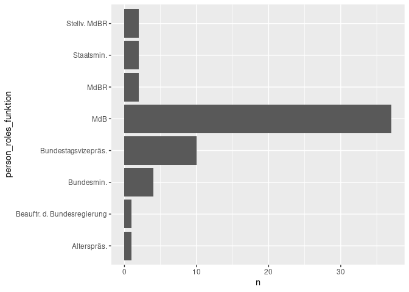

<!-- README.md is generated from README.Rmd. Please edit that file -->

# tidybundestag

<!-- badges: start -->
<!-- badges: end -->

`tidybundestag` wraps up the official API of the German Bundestag in R.

It can be used to retrieve data on:

-   activities (aktivität)
-   “Drucksachen”
-   Members of the Bundestag
-   Plenary protocols
-   Parliamentary processes (Vorgänge)

For more information on the API, please visit:
<https://dip.bundestag.de/documents/informationsblatt_zur_dip_api_v01.pdf>

## Installation

You can install the latest version of tidybundestag from Github with

``` r
remotes::install_github("benjaminguinaudeau/tidybundestag")
```

## Api Key

Access to the API is controlled with an API key. To obtain this api-key
please visit the Bundestag
[website](https://dip.bundestag.de/%C3%BCber-dip/hilfe/api#content).

tidybundestag functions will read the API key from the environment
variable `BUNDESTAG_API`. In order to add your key to your environment
file, you can use the function `edit_r_environ()` from the {{usethis}}.

This will open your .Renviron file in your text editor. Now, you can add
the following line to it:

``` r
BUNDESTAG_API="YOUR_API_KEY"
```

Save the file and restart R for the changes to take effect.

Alternatively, you can provide an explicit definition of your API key
with each function call using the `api_token` argument.

## Example

``` r
library(tidybundestag)
```

Once you have an api-key, you can start accessing data:

``` r
bt_vorgang(n_max = 100) %>%
  dplyr::glimpse()
#> ✓ Total number of retrievable units: 278049 (Maximum set to 100)
#> 
#> Retrieved 0 documents
#> Retrieved 50 documents
#> Done
#> ✓ Successfully retrieved 100 documents
#> Done
#> Rows: 100
#> Columns: 15
#> $ id                        <chr> "279808", "279807", "279806", "279804", "279…
#> $ beratungsstand            <chr> "Noch nicht beantwortet", "Noch nicht beantw…
#> $ vorgangstyp               <chr> "Kleine Anfrage", "Kleine Anfrage", "Kleine …
#> $ typ                       <chr> "Vorgang", "Vorgang", "Vorgang", "Vorgang", …
#> $ wahlperiode               <int> 19, 19, 19, 19, 19, 19, 19, 19, 19, 19, 19, …
#> $ initiative                <list> [<tbl_df[1 x 1]>], [<tbl_df[1 x 1]>], [<tbl…
#> $ datum                     <chr> "2021-06-30", "2021-06-30", "2021-06-30", "2…
#> $ titel                     <chr> "Zustand der Schleusen, Wehre und Brücken an…
#> $ sachgebiet                <list> <NULL>, <NULL>, <NULL>, <NULL>, <NULL>, [<t…
#> $ deskriptor                <list> <NULL>, <NULL>, <NULL>, <NULL>, <NULL>, [<t…
#> $ gesta                     <chr> NA, NA, NA, NA, NA, NA, NA, NA, NA, NA, NA, …
#> $ zustimmungsbeduerftigkeit <list> <NULL>, <NULL>, <NULL>, <NULL>, <NULL>, <NU…
#> $ abstract                  <chr> NA, NA, NA, NA, NA, NA, NA, NA, NA, NA, NA, …
#> $ ratsdok                   <chr> NA, NA, NA, NA, NA, NA, NA, NA, NA, NA, NA, …
#> $ kom                       <chr> NA, NA, NA, NA, NA, NA, NA, NA, NA, NA, NA, …
```

## Endpoints

The API of the Bundestag proposes 8 different endpoints.

`tidybundestag` always returns a tibble where each row represents one
unit (i.e. one process, one plenary, one questions, one person, etc…).
The original json-structure is embedded in the tibble as a list-column,
that can be easily handled with
[`tidyr`](https://tidyr.tidyverse.org/reference/nest.html).

### Activities

``` r
bt_aktivitaet(n_max = 100) %>%
  dplyr::glimpse()
#> ✓ Total number of retrievable units: 1545891 (Maximum set to 100)
#> 
#> Retrieved 0 documents
#> Retrieved 50 documents
#> Done
#> ✓ Successfully retrieved 100 documents
#> Done
#> Rows: 100
#> Columns: 10
#> $ id                   <chr> "1567422", "1567421", "1567420", "1567419", "1567…
#> $ aktivitaetsart       <chr> "Kleine Anfrage", "Kleine Anfrage", "Kleine Anfra…
#> $ typ                  <chr> "Aktivität", "Aktivität", "Aktivität", "Aktivität…
#> $ vorgangsbezug_anzahl <int> 1, 1, 1, 1, 1, 1, 1, 1, 1, 1, 1, 1, 1, 1, 1, 1, 1…
#> $ dokumentart          <chr> "Drucksache", "Drucksache", "Drucksache", "Drucks…
#> $ wahlperiode          <int> 19, 19, 19, 19, 19, 19, 19, 19, 19, 19, 19, 19, 1…
#> $ datum                <chr> "2021-06-30", "2021-06-30", "2021-06-30", "2021-0…
#> $ titel                <chr> "Stefan Gelbhaar, MdB, BÜNDNIS 90/DIE GRÜNEN", "M…
#> $ fundstelle           <list> [<tbl_df[1 x 8]>], [<tbl_df[1 x 8]>], [<tbl_df[1…
#> $ vorgangsbezug        <list> [<tbl_df[1 x 4]>], [<tbl_df[1 x 4]>], [<tbl_df[1…
```

### Drucksache

``` r
bt_drucksache(n_max = 100) %>%
  dplyr::glimpse()
#> ✓ Total number of retrievable units: 255085 (Maximum set to 100)
#> 
#> Retrieved 0 documents
#> Retrieved 50 documents
#> Done
#> ✓ Successfully retrieved 100 documents
#> Done
#> Rows: 100
#> Columns: 16
#> $ id                   <chr> "256344", "256343", "256342", "256341", "256340",…
#> $ drucksachetyp        <chr> "Kleine Anfrage", "Kleine Anfrage", "Kleine Anfra…
#> $ dokumentart          <chr> "Drucksache", "Drucksache", "Drucksache", "Drucks…
#> $ autoren_anzahl       <int> 0, 0, 0, 0, 0, 6, 11, 43, 40, 7, 37, 21, 12, 8, 1…
#> $ typ                  <chr> "Dokument", "Dokument", "Dokument", "Dokument", "…
#> $ vorgangsbezug_anzahl <int> 0, 0, 0, 0, 0, 1, 1, 1, 1, 1, 1, 1, 1, 1, 1, 1, 1…
#> $ dokumentnummer       <chr> "19/31297", "19/31296", "19/31295", "19/31294", "…
#> $ wahlperiode          <int> 19, 19, 19, 19, 19, 19, 19, 19, 19, 19, 19, 19, 1…
#> $ herausgeber          <chr> "BT", "BT", "BT", "BT", "BT", "BT", "BT", "BT", "…
#> $ datum                <chr> "2021-06-30", "2021-06-30", "2021-06-30", "2021-0…
#> $ titel                <chr> "Ausmaß und Struktur geringfügiger Beschäftigung …
#> $ fundstelle           <list> [<tbl_df[1 x 7]>], [<tbl_df[1 x 7]>], [<tbl_df[1…
#> $ autoren_anzeige      <list> <NULL>, <NULL>, <NULL>, <NULL>, <NULL>, [<tbl_df…
#> $ urheber              <list> <NULL>, <NULL>, <NULL>, <NULL>, <NULL>, [<tbl_df…
#> $ vorgangsbezug        <list> <NULL>, <NULL>, <NULL>, <NULL>, <NULL>, [<tbl_df…
#> $ ressort              <list> <NULL>, <NULL>, <NULL>, <NULL>, <NULL>, <NULL>, …
```

### Drucksache-Text

``` r
bt_drucksache_text(n_max = 20) %>%
  dplyr::glimpse()
#> ✓ Total number of retrievable units: 255085 (Maximum set to 20)
#> 
#> Retrieved 0 documents
#> Retrieved 10 documents
#> Done
#> ✓ Successfully retrieved 20 documents
#> Done
#> Rows: 20
#> Columns: 13
#> $ id              <chr> "256344", "256343", "256342", "256341", "256340", "256…
#> $ drucksachetyp   <chr> "Kleine Anfrage", "Kleine Anfrage", "Kleine Anfrage", …
#> $ dokumentart     <chr> "Drucksache", "Drucksache", "Drucksache", "Drucksache"…
#> $ autoren_anzahl  <int> 0, 0, 0, 0, 0, 6, 11, 43, 40, 7, 37, 21, 12, 8, 14, 14…
#> $ typ             <chr> "Dokument", "Dokument", "Dokument", "Dokument", "Dokum…
#> $ dokumentnummer  <chr> "19/31297", "19/31296", "19/31295", "19/31294", "19/31…
#> $ wahlperiode     <int> 19, 19, 19, 19, 19, 19, 19, 19, 19, 19, 19, 19, 19, 19…
#> $ herausgeber     <chr> "BT", "BT", "BT", "BT", "BT", "BT", "BT", "BT", "BT", …
#> $ datum           <chr> "2021-06-30", "2021-06-30", "2021-06-30", "2021-06-30"…
#> $ titel           <chr> "Ausmaß und Struktur geringfügiger Beschäftigung in De…
#> $ fundstelle      <list> [<tbl_df[1 x 7]>], [<tbl_df[1 x 7]>], [<tbl_df[1 x 7]…
#> $ autoren_anzeige <list> <NULL>, <NULL>, <NULL>, <NULL>, <NULL>, [<tbl_df[2 x …
#> $ urheber         <list> <NULL>, <NULL>, <NULL>, <NULL>, <NULL>, [<tbl_df[1 x …
```

### Person

``` r
bt_person(n_max = 20) %>%
  dplyr::glimpse()
#> ✓ Total number of retrievable units: 4969 (Maximum set to 20)
#> 
#> Retrieved 0 documents
#> Done
#> ✓ Successfully retrieved 50 documents
#> Done
#> Rows: 50
#> Columns: 10
#> $ id           <chr> "77", "76", "7196", "7190", "7168", "7151", "7134", "7111…
#> $ nachname     <chr> "Solms", "Schäffler", "Emmerich", "Gohl", "Wetzel", "Nölk…
#> $ vorname      <chr> "Hermann Otto", "Frank", "Marcel", "Christopher", "Wolfga…
#> $ typ          <chr> "Person", "Person", "Person", "Person", "Person", "Person…
#> $ wahlperiode  <int> 9, 16, 19, 19, 19, 19, 19, 19, 19, 19, 18, 19, 16, 15, 16…
#> $ basisdatum   <chr> "1980-12-18", "2005-12-01", "2021-06-08", "2021-05-05", "…
#> $ datum        <chr> "2021-06-30", "2021-06-30", "2021-06-30", "2021-06-30", "…
#> $ titel        <chr> "Dr. Hermann Otto Solms, MdB, FDP", "Frank Schäffler, MdB…
#> $ person_roles <list> [<tbl_df[5 x 4]>], <NULL>, <NULL>, <NULL>, <NULL>, <NULL…
#> $ namenszusatz <chr> NA, NA, NA, NA, NA, NA, NA, NA, NA, NA, NA, NA, NA, NA, N…
```

### Plenarprotokoll

``` r
bt_plenarprotokoll(n_max = 100) %>%
  dplyr::glimpse()
#> ✓ Total number of retrievable units: 5416 (Maximum set to 100)
#> 
#> Retrieved 0 documents
#> Retrieved 50 documents
#> Done
#> ✓ Successfully retrieved 100 documents
#> Done
#> Rows: 100
#> Columns: 12
#> $ id                   <chr> "5426", "5425", "5424", "5423", "5422", "5421", "…
#> $ dokumentart          <chr> "Plenarprotokoll", "Plenarprotokoll", "Plenarprot…
#> $ typ                  <chr> "Dokument", "Dokument", "Dokument", "Dokument", "…
#> $ vorgangsbezug_anzahl <int> 146, 133, 289, 100, 1, 115, 279, 100, 87, 72, 217…
#> $ dokumentnummer       <chr> "1006", "19/237", "19/236", "19/235", "29", "19/2…
#> $ wahlperiode          <int> 19, 19, 19, 19, 19, 19, 19, 19, 19, 19, 19, 19, 1…
#> $ herausgeber          <chr> "BR", "BT", "BT", "BT", "EK", "BT", "BT", "BT", "…
#> $ datum                <chr> "2021-06-25", "2021-06-25", "2021-06-24", "2021-0…
#> $ titel                <chr> "Protokoll der 1006. Sitzung des Bundesrates", "P…
#> $ fundstelle           <list> [<tbl_df[1 x 6]>], [<tbl_df[1 x 7]>], [<tbl_df[1…
#> $ vorgangsbezug        <list> [<tbl_df[4 x 3]>], [<tbl_df[4 x 3]>], [<tbl_df[4…
#> $ sitzungsbemerkung    <chr> NA, NA, NA, NA, "Bericht über das 29. Umfrageverf…
```

### Text of plenarprotokoll

``` r
bt_plenarprotokoll_text(n_max = 20) %>%
  dplyr::glimpse()
#> ✓ Total number of retrievable units: 5416 (Maximum set to 20)
#> 
#> Retrieved 0 documents
#> Retrieved 10 documents
#> Done
#> ✓ Successfully retrieved 20 documents
#> Done
#> Rows: 20
#> Columns: 11
#> $ id                <chr> "5426", "5425", "5424", "5423", "5422", "5421", "542…
#> $ dokumentart       <chr> "Plenarprotokoll", "Plenarprotokoll", "Plenarprotoko…
#> $ typ               <chr> "Dokument", "Dokument", "Dokument", "Dokument", "Dok…
#> $ dokumentnummer    <chr> "1006", "19/237", "19/236", "19/235", "29", "19/234"…
#> $ wahlperiode       <int> 19, 19, 19, 19, 19, 19, 19, 19, 19, 19, 19, 19, 19, …
#> $ herausgeber       <chr> "BR", "BT", "BT", "BT", "EK", "BT", "BT", "BT", "BR"…
#> $ datum             <chr> "2021-06-25", "2021-06-25", "2021-06-24", "2021-06-2…
#> $ titel             <chr> "Protokoll der 1006. Sitzung des Bundesrates", "Prot…
#> $ fundstelle        <list> [<tbl_df[1 x 6]>], [<tbl_df[1 x 7]>], [<tbl_df[1 x …
#> $ text              <chr> NA, "Deutscher Bundestag\nStenografischer Bericht\n2…
#> $ sitzungsbemerkung <chr> NA, NA, NA, NA, "Bericht über das 29. Umfrageverfahr…
```

### Vorgang

``` r
bt_vorgang(n_max = 100) %>%
  dplyr::glimpse()
#> ✓ Total number of retrievable units: 278049 (Maximum set to 100)
#> 
#> Retrieved 0 documents
#> Retrieved 50 documents
#> Done
#> ✓ Successfully retrieved 100 documents
#> Done
#> Rows: 100
#> Columns: 15
#> $ id                        <chr> "279808", "279807", "279806", "279804", "279…
#> $ beratungsstand            <chr> "Noch nicht beantwortet", "Noch nicht beantw…
#> $ vorgangstyp               <chr> "Kleine Anfrage", "Kleine Anfrage", "Kleine …
#> $ typ                       <chr> "Vorgang", "Vorgang", "Vorgang", "Vorgang", …
#> $ wahlperiode               <int> 19, 19, 19, 19, 19, 19, 19, 19, 19, 19, 19, …
#> $ initiative                <list> [<tbl_df[1 x 1]>], [<tbl_df[1 x 1]>], [<tbl…
#> $ datum                     <chr> "2021-06-30", "2021-06-30", "2021-06-30", "2…
#> $ titel                     <chr> "Zustand der Schleusen, Wehre und Brücken an…
#> $ sachgebiet                <list> <NULL>, <NULL>, <NULL>, <NULL>, <NULL>, [<t…
#> $ deskriptor                <list> <NULL>, <NULL>, <NULL>, <NULL>, <NULL>, [<t…
#> $ gesta                     <chr> NA, NA, NA, NA, NA, NA, NA, NA, NA, NA, NA, …
#> $ zustimmungsbeduerftigkeit <list> <NULL>, <NULL>, <NULL>, <NULL>, <NULL>, <NU…
#> $ abstract                  <chr> NA, NA, NA, NA, NA, NA, NA, NA, NA, NA, NA, …
#> $ ratsdok                   <chr> NA, NA, NA, NA, NA, NA, NA, NA, NA, NA, NA, …
#> $ kom                       <chr> NA, NA, NA, NA, NA, NA, NA, NA, NA, NA, NA, …
```

### Vorgangsposition

``` r
bt_vorgangsposition(n_max = 100) %>%
  dplyr::glimpse()
#> ✓ Total number of retrievable units: 595558 (Maximum set to 100)
#> 
#> Retrieved 0 documents
#> Retrieved 50 documents
#> Done
#> ✓ Successfully retrieved 100 documents
#> Done
#> Rows: 100
#> Columns: 21
#> $ id                 <chr> "1", "10", "100", "10001", "10002", "10006", "10008…
#> $ vorgangsposition   <chr> "Antrag zur Weitergeltung der Geschäftsordnung", "U…
#> $ zuordnung          <chr> "BT", "BR", "BT", "BT", "BT", "BT", "BT", "BT", "BT…
#> $ gang               <lgl> TRUE, TRUE, TRUE, TRUE, TRUE, TRUE, TRUE, TRUE, TRU…
#> $ fortsetzung        <lgl> FALSE, FALSE, FALSE, FALSE, FALSE, FALSE, FALSE, FA…
#> $ nachtrag           <lgl> FALSE, FALSE, FALSE, FALSE, FALSE, FALSE, FALSE, FA…
#> $ vorgangstyp        <chr> "Geschäftsordnung", "Bericht, Gutachten, Programm",…
#> $ typ                <chr> "Vorgangsposition", "Vorgangsposition", "Vorgangspo…
#> $ titel              <chr> "Weitergeltung von Geschäftsordnungsrecht (G-SIG: 1…
#> $ aktivitaet_anzahl  <int> 0, 0, 0, 14, 0, 6, 15, 37, 4, 0, 48, 13, 52, 46, 0,…
#> $ dokumentart        <chr> "Drucksache", "Drucksache", "Drucksache", "Drucksac…
#> $ vorgang_id         <chr> "3", "4", "42", "6063", "4624", "4628", "4629", "65…
#> $ datum              <chr> "2005-10-18", "2005-10-19", "2005-12-13", "2006-09-…
#> $ fundstelle         <list> [<tbl_df[5 x 8]>], [<tbl_df[1 x 9]>], [<tbl_df[5 x…
#> $ urheber            <list> [<tbl_df[5 x 3]>], [<tbl_df[1 x 3]>], [<tbl_df[5 x…
#> $ ueberweisung       <list> <NULL>, [<tbl_df[1 x 3]>], <NULL>, <NULL>, <NULL>,…
#> $ aktivitaet_anzeige <list> <NULL>, <NULL>, <NULL>, [<tbl_df[4 x 3]>], <NULL>,…
#> $ ressort            <list> <NULL>, <NULL>, <NULL>, <NULL>, <NULL>, <NULL>, <N…
#> $ beschlussfassung   <list> <NULL>, <NULL>, <NULL>, <NULL>, <NULL>, <NULL>, <N…
#> $ ratsdok            <chr> NA, NA, NA, NA, NA, NA, NA, NA, NA, NA, NA, NA, NA,…
#> $ kom                <chr> NA, NA, NA, NA, NA, NA, NA, NA, NA, NA, NA, NA, NA,…
```

## Query Parameter

-   id: id of the desired unit
-   start\_date: First day of the desired period (character string
    YYYY/MM/DD)
-   end\_date: Last day of the desired period (character string
    YYYY/MM/DD)
-   drucksache: Drucksache number of the desired unit
-   plenarprotokoll: Id of a plenary protocol related to the desired
    unit
-   vorgang: Id of a process related to the desired unit
-   zuordnung: Attribution to a given institution (one of
    `c('BT', 'BR', 'BV', 'EK')`)

### id

``` r
bt_vorgang(id = "279665")
#> ✓ Total number of retrievable units: 1 (Maximum set to 100)
#> 
#> Retrieved 0 documents
#> Retrieved 1 documents
#> Done
#> ✓ Successfully retrieved 1 documents
#> Done
#> # A tibble: 1 x 12
#>   id     beratungsstand     vorgangstyp  gesta sachgebiet     typ    wahlperiode
#>   <chr>  <chr>              <chr>        <chr> <list>         <chr>        <int>
#> 1 279665 Noch nicht beraten Gesetzgebung O009  <tibble [1 × … Vorga…          19
#> # … with 5 more variables: zustimmungsbeduerftigkeit <list>, initiative <list>,
#> #   datum <chr>, titel <chr>, deskriptor <list>
```

### start\_date

``` r
bt_vorgang(n_max = 100, start_date = "2021-01-01") %>%
  dplyr::glimpse()
#> ✓ Total number of retrievable units: 8674 (Maximum set to 100)
#> 
#> Retrieved 0 documents
#> Retrieved 50 documents
#> Done
#> ✓ Successfully retrieved 100 documents
#> Done
#> Rows: 100
#> Columns: 15
#> $ id                        <chr> "279808", "279807", "279806", "279804", "279…
#> $ beratungsstand            <chr> "Noch nicht beantwortet", "Noch nicht beantw…
#> $ vorgangstyp               <chr> "Kleine Anfrage", "Kleine Anfrage", "Kleine …
#> $ typ                       <chr> "Vorgang", "Vorgang", "Vorgang", "Vorgang", …
#> $ wahlperiode               <int> 19, 19, 19, 19, 19, 19, 19, 19, 19, 19, 19, …
#> $ initiative                <list> [<tbl_df[1 x 1]>], [<tbl_df[1 x 1]>], [<tbl…
#> $ datum                     <chr> "2021-06-30", "2021-06-30", "2021-06-30", "2…
#> $ titel                     <chr> "Zustand der Schleusen, Wehre und Brücken an…
#> $ sachgebiet                <list> <NULL>, <NULL>, <NULL>, <NULL>, <NULL>, [<t…
#> $ deskriptor                <list> <NULL>, <NULL>, <NULL>, <NULL>, <NULL>, [<t…
#> $ gesta                     <chr> NA, NA, NA, NA, NA, NA, NA, NA, NA, NA, NA, …
#> $ zustimmungsbeduerftigkeit <list> <NULL>, <NULL>, <NULL>, <NULL>, <NULL>, <NU…
#> $ abstract                  <chr> NA, NA, NA, NA, NA, NA, NA, NA, NA, NA, NA, …
#> $ ratsdok                   <chr> NA, NA, NA, NA, NA, NA, NA, NA, NA, NA, NA, …
#> $ kom                       <chr> NA, NA, NA, NA, NA, NA, NA, NA, NA, NA, NA, …
```

### end\_date

``` r
bt_drucksache(n_max = 100, end_date = "2020-01-01") %>%
  dplyr::glimpse()
#> ✓ Total number of retrievable units: 236663 (Maximum set to 100)
#> 
#> Retrieved 0 documents
#> Retrieved 50 documents
#> Done
#> ✓ Successfully retrieved 100 documents
#> Done
#> Rows: 100
#> Columns: 16
#> $ id                   <chr> "237635", "237626", "237622", "237619", "237611",…
#> $ drucksachetyp        <chr> "Antwort", "Antwort", "Antwort", "Antwort", "Antw…
#> $ dokumentart          <chr> "Drucksache", "Drucksache", "Drucksache", "Drucks…
#> $ autoren_anzahl       <int> 0, 0, 0, 0, 0, 0, 0, 0, 0, 0, 0, 0, 0, 0, 0, 0, 0…
#> $ typ                  <chr> "Dokument", "Dokument", "Dokument", "Dokument", "…
#> $ vorgangsbezug_anzahl <int> 1, 1, 1, 1, 1, 1, 1, 1, 1, 1, 1, 1, 1, 1, 1, 1, 1…
#> $ dokumentnummer       <chr> "19/16291", "19/16299", "19/16295", "19/16292", "…
#> $ wahlperiode          <int> 19, 19, 19, 19, 19, 19, 19, 19, 19, 19, 19, 19, 1…
#> $ herausgeber          <chr> "BT", "BT", "BT", "BT", "BT", "BT", "BT", "BT", "…
#> $ datum                <chr> "2019-12-30", "2019-12-30", "2019-12-30", "2019-1…
#> $ titel                <chr> "auf die Kleine Anfrage\r\n- Drucksache 19/14743 …
#> $ fundstelle           <list> [<tbl_df[1 x 8]>], [<tbl_df[1 x 8]>], [<tbl_df[1…
#> $ ressort              <list> [<tbl_df[1 x 2]>], [<tbl_df[1 x 2]>], [<tbl_df[1…
#> $ urheber              <list> [<tbl_df[1 x 3]>], [<tbl_df[1 x 3]>], [<tbl_df[1…
#> $ vorgangsbezug        <list> [<tbl_df[1 x 3]>], [<tbl_df[1 x 3]>], [<tbl_df[1…
#> $ autoren_anzeige      <list> <NULL>, <NULL>, <NULL>, <NULL>, <NULL>, <NULL>, …
```

### drucksache

``` r
bt_vorgang(drucksache = 68852) %>%
  dplyr::glimpse()
#> ✓ Total number of retrievable units: 1 (Maximum set to 100)
#> 
#> Retrieved 0 documents
#> Retrieved 1 documents
#> Done
#> ✓ Successfully retrieved 1 documents
#> Done
#> Rows: 1
#> Columns: 12
#> $ id             <chr> "84343"
#> $ abstract       <chr> "Übernahme von Geschäftsordnungen durch den 19. Deutsch…
#> $ beratungsstand <chr> "Abgeschlossen"
#> $ vorgangstyp    <chr> "Geschäftsordnung"
#> $ sachgebiet     <list> [<tbl_df[1 x 1]>]
#> $ typ            <chr> "Vorgang"
#> $ wahlperiode    <int> 19
#> $ initiative     <list> [<tbl_df[1 x 1]>]
#> $ datum          <chr> "2019-03-27"
#> $ titel          <chr> "Weitergeltung von Geschäftsordnungsrecht"
#> $ deskriptor     <list> [<tbl_df[6 x 3]>]
#> $ verkuendung    <list> [<tbl_df[1 x 11]>]
```

### plenarprotokoll

``` r
bt_vorgang(plenarprotokoll = 908) %>%
  dplyr::glimpse()
#> ✓ Total number of retrievable units: 6 (Maximum set to 100)
#> 
#> Retrieved 0 documents
#> Retrieved 6 documents
#> Done
#> ✓ Successfully retrieved 6 documents
#> Done
#> Rows: 6
#> Columns: 12
#> $ id             <chr> "84343", "84396", "84394", "84393", "84352", "84344"
#> $ abstract       <chr> "Übernahme von Geschäftsordnungen durch den 19. Deutsch…
#> $ beratungsstand <chr> "Abgeschlossen", "Abgeschlossen", "Abgeschlossen", NA, …
#> $ vorgangstyp    <chr> "Geschäftsordnung", "Wahl im BT", "Wahl im BT", "Anspra…
#> $ sachgebiet     <list> [<tbl_df[1 x 1]>], [<tbl_df[1 x 1]>], [<tbl_df[1 x 1]>]…
#> $ typ            <chr> "Vorgang", "Vorgang", "Vorgang", "Vorgang", "Vorgang",…
#> $ wahlperiode    <int> 19, 19, 19, 19, 19, 19
#> $ initiative     <list> [<tbl_df[1 x 1]>], <NULL>, <NULL>, <NULL>, [<tbl_df[1 x…
#> $ datum          <chr> "2019-03-27", "2017-10-24", "2017-10-24", "2017-10-24",…
#> $ titel          <chr> "Weitergeltung von Geschäftsordnungsrecht", "Wahl der …
#> $ deskriptor     <list> [<tbl_df[6 x 3]>], [<tbl_df[2 x 3]>], [<tbl_df[3 x 3]>]…
#> $ verkuendung    <list> [<tbl_df[1 x 11]>], <NULL>, <NULL>, <NULL>, <NULL>, <NU…
```

### zuordnung

``` r
bt_plenarprotokoll(n_max = 100, zuordnung = "BT") %>%
  dplyr::glimpse()
#> ✓ Total number of retrievable units: 4361 (Maximum set to 100)
#> 
#> Retrieved 0 documents
#> Retrieved 50 documents
#> Done
#> ✓ Successfully retrieved 100 documents
#> Done
#> Rows: 100
#> Columns: 11
#> $ id                   <chr> "5425", "5424", "5423", "5421", "5420", "5419", "…
#> $ dokumentart          <chr> "Plenarprotokoll", "Plenarprotokoll", "Plenarprot…
#> $ typ                  <chr> "Dokument", "Dokument", "Dokument", "Dokument", "…
#> $ vorgangsbezug_anzahl <int> 133, 289, 100, 115, 279, 100, 72, 217, 99, 48, 14…
#> $ dokumentnummer       <chr> "19/237", "19/236", "19/235", "19/234", "19/233",…
#> $ wahlperiode          <int> 19, 19, 19, 19, 19, 19, 19, 19, 19, 19, 19, 19, 1…
#> $ herausgeber          <chr> "BT", "BT", "BT", "BT", "BT", "BT", "BT", "BT", "…
#> $ datum                <chr> "2021-06-25", "2021-06-24", "2021-06-23", "2021-0…
#> $ titel                <chr> "Protokoll der 237. Sitzung des 19. Deutschen Bun…
#> $ fundstelle           <list> [<tbl_df[1 x 7]>], [<tbl_df[1 x 7]>], [<tbl_df[1…
#> $ vorgangsbezug        <list> [<tbl_df[4 x 3]>], [<tbl_df[4 x 3]>], [<tbl_df[4…
```

## Unnest list-columns

``` r
members <- bt_person(n_max = 200) %>%
  dplyr::glimpse()
#> ✓ Total number of retrievable units: 4969 (Maximum set to 200)
#> 
#> Retrieved 0 documents
#> Retrieved 50 documents
#> Retrieved 100 documents
#> Retrieved 150 documents
#> Done
#> ✓ Successfully retrieved 200 documents
#> Done
#> Rows: 200
#> Columns: 10
#> $ id           <chr> "77", "76", "7196", "7190", "7168", "7151", "7134", "7111…
#> $ nachname     <chr> "Solms", "Schäffler", "Emmerich", "Gohl", "Wetzel", "Nölk…
#> $ vorname      <chr> "Hermann Otto", "Frank", "Marcel", "Christopher", "Wolfga…
#> $ typ          <chr> "Person", "Person", "Person", "Person", "Person", "Person…
#> $ wahlperiode  <int> 9, 16, 19, 19, 19, 19, 19, 19, 19, 19, 18, 19, 16, 15, 16…
#> $ basisdatum   <chr> "1980-12-18", "2005-12-01", "2021-06-08", "2021-05-05", "…
#> $ datum        <chr> "2021-06-30", "2021-06-30", "2021-06-30", "2021-06-30", "…
#> $ titel        <chr> "Dr. Hermann Otto Solms, MdB, FDP", "Frank Schäffler, MdB…
#> $ person_roles <list> [<tbl_df[5 x 4]>], <NULL>, <NULL>, <NULL>, <NULL>, <NULL…
#> $ namenszusatz <chr> NA, NA, NA, NA, NA, NA, NA, NA, NA, NA, NA, NA, NA, NA, N…

roles <- members %>%
  tidyr::unnest(person_roles, names_sep = "_", keep_empty = T) %>%
  dplyr::glimpse()
#> Rows: 235
#> Columns: 18
#> $ id                              <chr> "77", "77", "77", "77", "77", "76", "7…
#> $ nachname                        <chr> "Solms", "Solms", "Solms", "Solms", "S…
#> $ vorname                         <chr> "Hermann Otto", "Hermann Otto", "Herma…
#> $ typ                             <chr> "Person", "Person", "Person", "Person"…
#> $ wahlperiode                     <int> 9, 9, 9, 9, 9, 16, 19, 19, 19, 19, 19,…
#> $ basisdatum                      <chr> "1980-12-18", "1980-12-18", "1980-12-1…
#> $ datum                           <chr> "2021-06-30", "2021-06-30", "2021-06-3…
#> $ titel                           <chr> "Dr. Hermann Otto Solms, MdB, FDP", "D…
#> $ person_roles_funktion           <chr> "Alterspräs.", "Bundestagsvizepräs.", …
#> $ person_roles_nachname           <chr> "Solms", "Solms", "Solms", "Solms", "S…
#> $ person_roles_vorname            <chr> "Hermann Otto", "Hermann Otto", "Herma…
#> $ person_roles_wahlperiode_nummer <list> 19, 14, 15, 16, 17, <NULL>, <NULL>, <…
#> $ person_roles_fraktion           <chr> NA, NA, NA, NA, NA, NA, NA, NA, NA, NA…
#> $ person_roles_ressort_titel      <chr> NA, NA, NA, NA, NA, NA, NA, NA, NA, NA…
#> $ person_roles_funktionszusatz    <chr> NA, NA, NA, NA, NA, NA, NA, NA, NA, NA…
#> $ person_roles_bundesland         <chr> NA, NA, NA, NA, NA, NA, NA, NA, NA, NA…
#> $ person_roles_wahlkreiszusatz    <chr> NA, NA, NA, NA, NA, NA, NA, NA, NA, NA…
#> $ namenszusatz                    <chr> NA, NA, NA, NA, NA, NA, NA, NA, NA, NA…
```

``` r
roles %>%
  dplyr::filter(!is.na(person_roles_funktion)) %>%
  dplyr::count(person_roles_funktion) %>%
  ggplot2::ggplot(ggplot2::aes(person_roles_funktion, n)) +
  ggplot2::geom_col() +
  ggplot2::coord_flip()
```


